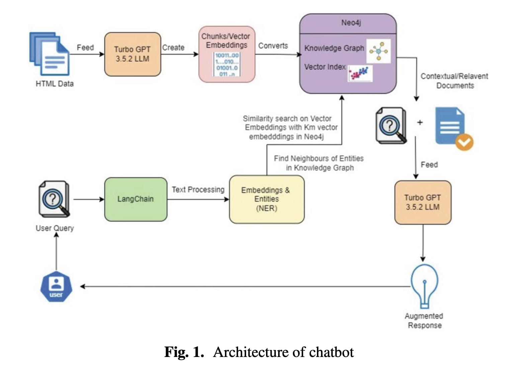

<div align="center">

# Enhancing Generative AI Chatbot Accuracy Using Knowledge Graph

<a href='https://www.isca-hq.org/SEDE/conference_program.html'></a>
<a href='https://www.ruidazeng.com/files/Enhancing%20Generative%20AI%20Chatbot%20Accuracy%20Using%20Knowledge%20Graph.pdf'></a>
<a href='https://nwmissouri.edu/'></a>

[**Overview**](#overview) | [**Key Features**](#key-features) | [**Quick Start**](#quick-start)



</div>

## Overview

A graph-based chatbot system that uses Neo4j and LangChain to enhance generative AI responses by leveraging structured knowledge representation.

## Key Features

- Graph-based knowledge representation using Neo4j
- LangChain integration for natural language understanding
- Vector similarity search for relevant document retrieval 
- Hybrid search combining structured and unstructured data
- Real-time Q&A through web interface
- High accuracy on domain-specific queries

## Quick Start

1. Install dependencies:
```bash
pip install langchain langchain-community langchain-openai neo4j streamlit
```

2. Configure environment:
```bash
export OPENAI_API_KEY="your-key"
export NEO4J_URI="your-uri" 
export NEO4J_USERNAME="username"
export NEO4J_PASSWORD="password"
```

3. Run application:
```bash
streamlit run app.py
```

## Authors

- Ajay Bandi
- Jameer Babu
- Ruida Zeng
- Sai Ram Muthyala
